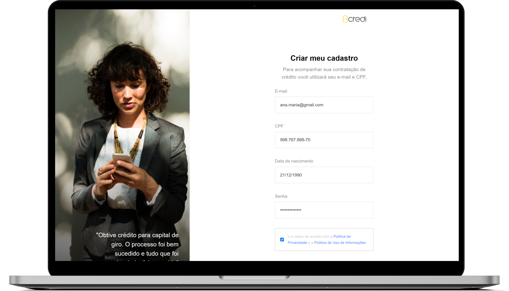

<h1 align="center">
  </img>
</h1>

<p align="center">
  <a href="#ℹ-descrição">Descrição</a> •
  <a href="#-tecnologias">Tecnologias</a> •
  <a href="#-pré-requisitos">Pré-requisitos</a> •
  <a href="#-como-usar">Como usar</a> <!-- •
  <a href="#-demonstração">Demonstração</a> -->
</p>

<p align="center">
  </img>
</p>

<p align="center">
  
  
  
</p>

## ℹ Descrição

Projeto desenvolvido como [desafio da Bcredi para função de Dev front-end](https://github.com/bcredi/bcredi-frontend-challenge). 👨‍🚀🚀

O desafio consistia em codificar uma interface de login conforme o
design do _Zeplin_, sendo que os requisitos obrigatórios são:

- Design responsivo e cross-browser (IE10+, Chrome, Safari e Firefox);
- Pelo menos uma estratégia para organização do CSS;
- Validações no formulário;
  - Campos obrigatórios;
  - Formatos; e
- Testes

## ⚒ Tecnologias

- [**Svelte**](https://svelte.dev)
- [**Typescript**](https://www.typescriptlang.org)
- [**SvelteKit**](https://kit.svelte.dev)
- [**TailwindCSS**](https://tailwindcss.com)
- [**Playwright**](https://playwright.dev)

## ⚙ Pré-requisitos

- [Git](https://git-scm.com)
- [Yarn](https://yarnpkg.com)
- Editor de código.

## 🖥 Como usar

**Clone o projeto e acesse a pasta**

```bash
$ git clone https://github.com/EduardoReisUX/sign-up.git && cd sign-up
```

**Siga os passos seguintes**

```bash
# Instale as dependências
$ yarn

# Verifique os testes
# 🚧 Atenção, esse comando pode não funcionar pois
#       a integração de Playwright com SvelteKit é super recente.
#       Veja mais: https://github.com/microsoft/playwright/issues/12487
$ yarn test:e2e

# Inicie a aplicação na sua máquina
$ yarn dev

# Faça o build e o visualize
$ yarn build && yarn preview
```

<!-- ## 👀 Demonstração

<p align="center">
  </img>
</p> -->

---

<p align="center">Feito com 💜 por <a href="https://github.com/EduardoReisUX">Eduardo dos Reis</a></p>
